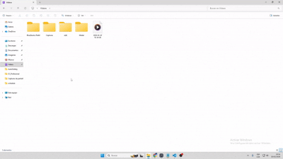

# 1to1: 12-Point Click Automation

[](https://www.autohotkey.com/)
[](https://opensource.org/licenses/MIT)

A customizable AutoHotkey script that maps 12 keyboard keys (Q W E R A S D F Z X C V) to specific screen positions. Click any key to instantly click at its assigned location. Perfect for gaming, repetitive tasks, or any situation where you need quick access to multiple screen positions.



## ✨ Features

- **12 Assignable Points** - Each key has its own click position
- **Visual Overlay** - Toggle circles showing key positions (Alt+O)
- **Drag & Drop** - Reposition points by clicking and dragging
- **Context Window** - Restrict hotkeys to a specific window (Alt+W)
- **Toggle Mode** - Enable/disable hotkeys on the fly (Alt+H)
- **Reset Function** - Restore default grid layout (Alt+R)

## 🎮 Quick Start

1. Install [AutoHotkey](https://www.autohotkey.com/) v2 or later
2. Download `1to1.ahk`
3. Double-click to run
4. Press any key from Q to V to click at its default position

## ⌨️ Controls

| Hotkey | Action |
|--------|--------|
| **Q W E R A S D F Z X C V** | Click at assigned position |
| **Alt+O** | Toggle visual overlay on/off |
| **Alt+R** | Reset all points to default positions |
| **Alt+H** | Enable/disable hotkey mode |
| **Alt+W** | Select current window for context-sensitive mode |

### Mouse Controls
- **Click & Drag** any circle to reposition it
- New positions are saved automatically

## ⚙️ How It Works

The script creates 12 click points arranged in a 4×3 grid by default:
```
Q   W   E   R
A   S   D   F
Z   X   C   V
```

Each point shows its assigned key in a tooltip circle when the overlay is enabled. The coordinates are stored in screen coordinates, so points stay in the same place regardless of which window is active.

## 🎯 Use Cases

- **Gaming** - Quick access to ability buttons, inventory slots, or map locations
- **Data Entry** - Click specific form fields without moving your hands from keyboard
- **Testing** - Automate repetitive UI testing sequences
- **Accessibility** - Alternative input method for users with mobility limitations

## 🔧 Configuration

### Default Positions
The points initialize in a grid pattern. Modify the `InitializePoints()` function to change:
- Number of columns/rows
- Margins from screen edges
- Spacing between points

### Visual Settings
Adjust these variables at the top of the script:
```autohotkey
PointRadius := 15   ; Size of clickable circles
```

### Hotkey Keys
The keys are defined in the `Keys` array. Modify to use different keys:
```autohotkey
global Keys := ["q", "w", "e", "r", "a", "s", "d", "f", "z", "x", "c", "v"]
```

## 📝 Tips

- Use **Alt+W** to limit hotkeys to a specific application (great for gaming)
- Toggle overlay off (**Alt+O**) when not needed to reduce visual clutter
- Points remember their positions until you reset them or close the script
- The script runs in the system tray - right-click the green H icon for options

## 🤝 Contributing

Found a bug or have a feature request? Feel free to open an issue or submit a pull request!

## 📜 License

This project is licensed under the MIT License - see the [LICENSE](LICENSE) file for details.

## 🙏 Acknowledgments

- Built with [AutoHotkey](https://www.autohotkey.com/)
- Inspired by gaming mouse software and productivity tools
